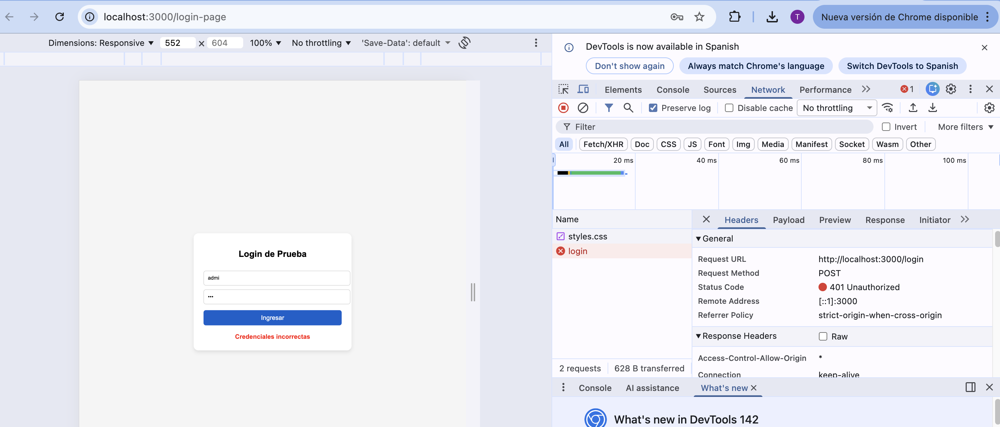
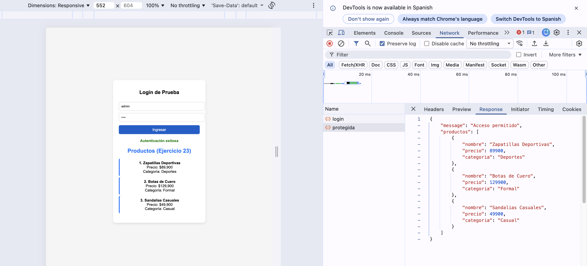

# TallerWebFinal

*Una vez clonado el proyecto ejecutar npm install*

## Ejercicios

### 21. Servidor web básico
Crea un archivo server.ts (o server.js) que muestre el mensaje "Servidor web en ejecución" al ingresar a http://localhost:3000.

- **Localizado en:** `src/server.ts`
- **Para ejecutar usar:** `npm run dev`
- **Resultado:** Al acceder a `http://localhost:3000` se muestra el mensaje "Servidor web en ejecución"

### 22. Ruta protegida con autenticación
Agrega una ruta protegida en Express que devuelva el mensaje "Acceso permitido" solo si el usuario está autenticado (puede simular la autenticación con una variable booleana).

- **Localizado en:** `src/server.ts`
- **Ruta protegida:** `http://localhost:3000/protegida`
- **Endpoint de login:** `POST http://localhost:3000/login`
- **Credenciales de prueba:** 
  - Usuario: `admin`
  - Contraseña: `1234`
- **Página de login:** `http://localhost:3000/login-page`

### 23. Interfaz Producto en TypeScript
Escribe un pequeño fragmento de código en TypeScript que defina una interfaz Producto con los campos nombre, precio y categoria, e imprime un arreglo con 3 productos.

- **Localizado en:** `src/models/producto.ts`
- **Para ejecutar directamente:** `npx ts-node src/models/producto.ts`
- **Integrado con el servidor:** Después de hacer login exitoso, los productos se muestran automáticamente en la página de login
- **Ruta protegida:** `http://localhost:3000/protegida` (requiere autenticación previa)
- **Resultado:** 
  - Define la interfaz `Producto` con campos: `nombre`, `precio`, `categoria`
  - Contiene un arreglo con 3 productos de ejemplo
  - Se muestra automáticamente después de un login exitoso en `http://localhost:3000/login-page`
  - También disponible en formato JSON en la ruta protegida `/protegida`

### 24. Dockerfile para Node.js con Express
Crea un archivo Dockerfile básico que contenga las instrucciones para dockerizar una aplicación Node.js con Express.

- **Localizado en:** `Dockerfile`
- **Descripción:** 
  - Usa la imagen base `node:20-alpine` para optimizar el tamaño
  - Instala las dependencias del proyecto
  - Compila TypeScript a JavaScript
  - Expone el puerto 3000
  - Ejecuta la aplicación compilada con Node.js
- **Archivos relacionados:**
  - `.dockerignore`: Excluye archivos innecesarios de la imagen Docker

### 25. Pasos para ejecutar la aplicación en Docker
Redacta brevemente los pasos para ejecutar tu aplicación en un contenedor Docker desde la terminal (crear imagen, correr contenedor y verificar puerto).

**Pasos para ejecutar la aplicación en Docker:**

1. **Asegúrate de que Docker esté instalado y corriendo**
   - Verifica con: `docker --version`
   - Si no está corriendo, inicia Docker Desktop

2. **Construir la imagen Docker**
   ```bash
   docker build -t tallerweb .
   ```
   - `-t tallerweb`: Asigna el nombre "tallerweb" a la imagen
   - `.`: Indica que el Dockerfile está en el directorio actual

3. **Ejecutar el contenedor**
   ```bash
   docker run -p 3000:3000 tallerweb
   ```
   - `-p 3000:3000`: Mapea el puerto 3000 del contenedor al puerto 3000 del host
   - `tallerweb`: Nombre de la imagen a ejecutar

4. **Verificar que la aplicación esté corriendo**
   - Abre tu navegador y visita: `http://localhost:3000`
   - Deberías ver el mensaje "Servidor web en ejecución"
   - También puedes verificar con: `curl http://localhost:3000`

5. **Comandos útiles adicionales**
   ```bash
   # Ver contenedores en ejecución
   docker ps
   
   # Detener el contenedor (Ctrl+C o en otra terminal)
   docker stop <container_id>
   
   # Ver imágenes creadas
   docker images
   
   # Ejecutar en segundo plano
   docker run -d -p 3000:3000 tallerweb
   ```

## Demostración

### Intento de login fallido


**Descripción:** Muestra un intento de login con credenciales incorrectas. El usuario ingresó "admi" como nombre de usuario, lo que resultó en un error 401 Unauthorized. La página muestra el mensaje "Credenciales incorrectas" en rojo, y en las herramientas de desarrollador se puede ver que la petición POST a `/login` retornó un código de estado 401.

### Login exitoso


**Descripción:** Muestra un login exitoso con las credenciales correctas (usuario: "admin", contraseña: "1234"). La página muestra el mensaje "Autenticación exitosa" en verde, y en las herramientas de desarrollador se puede ver que la petición POST a `/login` retornó un código de estado 200 OK, confirmando que la autenticación fue exitosa.

### Visualización de productos después del login


**Descripción:** Una vez completado el login exitoso, la aplicación muestra automáticamente la lista de productos del ejercicio 23. En la parte izquierda se puede ver la interfaz web con los tres productos formateados de manera legible: Zapatillas Deportivas ($89,900), Botas de Cuero ($129,900) y Sandalias Casuales ($49,900), cada uno con su respectiva categoría. En la parte derecha, las herramientas de desarrollador muestran la petición a la ruta protegida `/protegida` y su respuesta JSON completa, donde se puede observar el arreglo de productos con toda su estructura. Esto demuestra cómo el ejercicio 23 se integra perfectamente con el sistema de autenticación, mostrando los productos tanto en el frontend como en la respuesta de la API.
